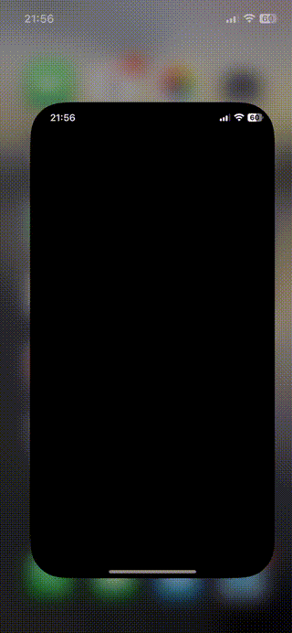

# DebugSwiftDemoApp with DebugSwift Integration

DebugSwiftDemoApp is a simple Swift-based application showcasing the integration of **DebugSwift**—a powerful debugging tool designed to simplify debugging and streamline the development workflow. This is the base code referenced in the post [DebugSwift: Streamline Your Debugging Workflow](https://javios.eu/uncategorized/debugswift-streamline-your-debugging-workflow/)

## Features

  

- **DebugSwift Integration**:
  - Seamlessly inspect, log, and monitor your application during runtime.
  - Advanced debugging features like real-time logging, customizable breakpoints, and performance monitoring.

- **Simple Demo Interface**:
  - Interactive UI to trigger and demonstrate various debugging scenarios.
  - Example use cases for common debugging needs in Swift development.

- **Cross-platform Support**:
  - Works on iOS and macOS platforms.

## Requirements

- Xcode 16.0 or later
- iOS 15.0+ or macOS 11.0+
- DebugSwift library (see installation steps below)

